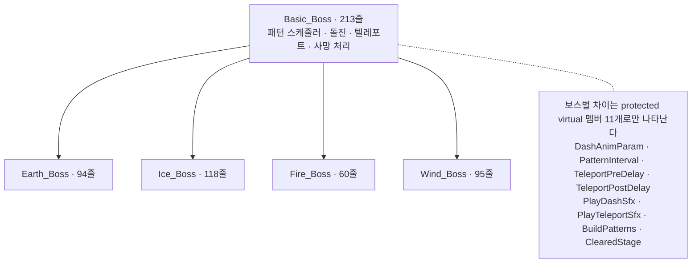

# Another World In The Morning

2023년에 팀 5명이 만든 **Unity 2D 액션 플랫포머**입니다. 2026년에 그 코드를 **혼자
리팩토링**했고, 이 저장소는 그 과정의 기록입니다.

<!-- 미디어 ① 플레이 GIF. 촬영 목록은 docs/media/README.md 에 있다.
     넣을 때 이 주석을 지우고 아래 줄을 살린다.

-->

검·창·방패 중 하나를 골라 **대지 → 얼음 → 불 → 바람** 네 스테이지의 보스를 잡는 게임입니다.
2023년 팀에서 저는 **인벤토리·대화 시스템·씬 흐름과 보스 2종**을 맡았습니다.
2026년에는 그 코드를 **동작을 바꾸지 않으면서 정리하고, 정말 바뀌지 않았는지 검증**했습니다.

> **이 저장소에서 봐 주셨으면 하는 것은 정리된 코드가 아니라 검증 기록입니다.**
> 테스트가 하나도 없고 원 작성자에게 물을 수 없는 코드를, 어떻게 정리했고 정리한 것이
> 정말 같은 동작인지 어떻게 확인했는가 — 그것이 이 저장소의 내용입니다.

---

## 한눈에

**게임** — 2022-10 ~ 2023-08 · 팀 5명

| | |
| --- | --- |
| 장르 | 2D 액션 플랫포머 |
| 엔진 | Unity 2021.3.0f1 |
| 분량 | 스테이지 9개 (본편 4 + 보스 4 + 미로) · 튜토리얼 · 엔딩 |
| 보스 | 4종 (대지 · 얼음 · 불 · 바람) + 보스 러시 모드 |
| 플레이 | 캐릭터 3종 (검 · 창 · 방패) · 난이도 2단계 (이지 · 하드) |
| 언어 | 한국어 · 영어 (Unity Localization) |
| 팀 커밋 | 651개 |

**리팩토링** — 2026-08-27 ~ 09-02 · 1인

| | |
| --- | --- |
| 자동 테스트 | **0개 → 플레이모드 10개** |
| 찾아서 고친 결함 | **5건** (전부 리팩토링 중 발견, 셋은 플레이로 안 보임) |
| 검증 층 | 3개 — 컴파일 / 정적 시퀀스 대조 / **실행** |
| 없앤 클래스 | 20개 (중복 통합 + 죽은 코드) |
| 대상 | `Assets/Scripts/` C# 134개 파일 · 약 8,000줄 |
| 커밋 | [`Main_Backup...refactor/boss-pattern`](https://github.com/SangMyeong5426/PlatformerProject/compare/Main_Backup...refactor/boss-pattern) |

---

## 게임 보기

<!-- 미디어 ② 스크린샷 3~4장. 촬영 목록은 docs/media/README.md 에 있다.
     넣을 때 이 주석을 지우고 아래 표를 살린다.

| 캐릭터 선택 | 스테이지 | 보스전 | 대화 |
| --- | --- | --- | --- |
|  |  |  |  |
-->

<!-- TODO 플레이 가능한 빌드. WebGL(itch.io) 또는 Windows(GitHub Release) 중 결정한 뒤
     여기에 링크 한 줄. 그때까지는 위 GIF 가 유일한 체험 경로다. -->

---

## 2023년 팀 프로젝트에서 제가 한 것

팀 5명이 10개월간 651커밋을 쌓았습니다. 그중 제가 **만들고 주로 손댄 것**은 아래입니다.
자기 신고가 아니라 `git log` 로 확인할 수 있는 범위만 적었습니다 — 파일을 처음 만든 커밋과
그 파일의 커밋 분포 기준입니다.

| 영역 | 제가 만든 스크립트 |
| --- | --- |
| 인벤토리 | `Inventory` · `InventoryUI` · `Slot` · `DropItem` · `Player_UsingItem` |
| 대화 시스템 | `TalkManager` · `EndTalkManager` · `NPCTri` 계열 |
| 게임 흐름 | `GameManager` · `NextScene` · `LoadingSceneController` · `DiePannel` |
| 전역 상태 | `BoolManager` · `BoolReset` |
| 선택 화면 | `SelectChar` · `DataMgr` |
| 보스 | 불 보스 · 바람 보스 |

```bash
# 위 표의 근거를 직접 확인하는 방법
git log --all --no-merges --diff-filter=A --format='%an %ad' --date=short -- '*/Inventory.cs'
```

나머지 영역(플레이어 조작, 일반 몬스터 AI, 레벨 디자인, 대지·얼음 보스)은 팀원들이
맡았습니다. **2026년 리팩토링은 제 것이 아닌 부분까지 전부 포함합니다.**

---

## 이 저장소를 보는 순서

처음 오셨다면 이 셋만 보셔도 됩니다.

1. **[검증을 어떻게 했는가](#검증을-어떻게-했는가)** — 이 프로젝트의 핵심입니다
2. **[`docs/work-log/`](docs/work-log/)** — 하루치 작업에서 무엇이 어긋났는지
3. **[`docs/adr/`](docs/adr/)** — 되돌리기 어려운 결정과 그 근거

---

## 무엇을 했는가

### 중복 통합

같은 일을 하는 클래스가 스테이지마다 따로 있었습니다.

| 통합 전 | 통합 후 | 어떻게 |
| --- | --- | --- |
| 보스 4종이 각자 패턴 스케줄러·돌진·텔레포트를 복제 | `Basic_Boss` + 훅 | [ADR-0002](docs/adr/0002-boss-template-method-hooks.md) |
| 대화 매니저 3종 (571줄) | `TalkManagerBase` (386줄) | [work log](docs/work-log/2026-08-31-talk-and-bugfixes.md) |
| 보스 포탈 4개 | `BossClearPortal` + `StageId` | [ADR-0003](docs/adr/0003-stage-id-enum.md) |
| 대화 트리거 4개 (`NPCTri`~`NPCTri4`) | `TalkTrigger` + `TalkChannel` | 〃 |

보스 쪽이 가장 컸습니다. 공통 부모 `Basic_Boss` 는 이미 있었지만 **체력·데미지 필드만
갖고 있었고**, 패턴 스케줄러와 돌진·텔레포트 코루틴은 보스 4종이 각자 복사해 갖고
있었습니다.



보스 4종 **557줄 → 367줄**, 공통 골격 **124줄 → 213줄**. 줄이 줄어든 것보다,
**"이 보스는 무엇이 다른가"가 오버라이드 목록과 같아진 것**이 목적이었습니다.

상속 계층 대신 훅을 고른 이유, 그리고 `ScriptableObject` 와 Strategy 를 검토하고 버린
이유는 [ADR-0002](docs/adr/0002-boss-template-method-hooks.md) 에 있습니다.

### 찾아서 고친 결함 5건

전부 **리팩토링 중에 드러난 것**이고, 플레이로는 보이지 않던 것이 셋입니다.

| 결함 | 어떻게 드러났나 |
| --- | --- |
| **영어 로케일에서 게임이 멈춘다** | 영어 대사를 한국어 딕셔너리에 담아 `Dictionary.Add` 가 예외 |
| 대지 보스 탄환이 **얼음 보스의 데미지 값**을 읽는다 | 두 값이 프리팹에서 모두 `1` 이라 화면상 차이가 없었다 |
| 바람 보스 패턴 4개 중 2개가 같은 함수 | 동작 기준표를 만들다 발견 |
| **보스·몬스터 체력이 프리팹 에셋에 쓰인다** | 플레이할 때마다 `.prefab` 파일이 오염된다 |
| 검증 도구가 컴파일 실패를 `PASS` 로 냈다 | 내가 만든 도구의 결함 |

두 번째 것은 고치는 데 두 줄이 들었습니다.

```diff
- Debug.Log("플레이어 체력 = " + (player_Hp.currentHealth - EarthBullet_Damage.IceWave_Damage));
- player_Hp.TakeDamage(EarthBullet_Damage.IceWave_Damage);
+ Debug.Log("플레이어 체력 = " + (player_Hp.currentHealth - EarthBullet_Damage.EarthBullet_Damage));
+ player_Hp.TakeDamage(EarthBullet_Damage.EarthBullet_Damage);
```

대지 보스의 탄환이 **자기 데미지 대신 얼음 파도의 데미지**를 읽고 있었습니다. 두 값이
프리팹에서 모두 `1` 이라 플레이해도 차이가 없고, 어느 한쪽을 조정하는 순간 드러날
결함이었습니다. 클래스 이름을 정리하며 필드 이름을 마주치기 전까지는 보이지 않았습니다.

마지막 것은 제 실수입니다. 오류 판정을 `"): error "` 로 해서 **파일·행 번호가 없는 오류를
놓치고 있었습니다.** 유일한 단서가 경고 수가 59 → 0 으로 떨어진 것이었습니다.

---

## 검증을 어떻게 했는가

**이 저장소의 핵심입니다.** CI 가 없고 테스트도 없었습니다. 그래서 검증 수단을 직접
만들면서 진행했습니다.

| 층 | 도구 | 무엇을 보는가 | 무엇을 **못** 보는가 |
| --- | --- | --- | --- |
| 컴파일 | [`scripts/compile-check`](scripts/) | Unity 없이 134개 파일 컴파일 | 실행하면 어떻게 되는가 |
| 정적 대조 | [`scripts/boss-pattern-diff`](scripts/) | 보스 패턴 21개의 **연산 시퀀스**가 리팩토링 전과 같은가 | 그 시퀀스가 실제로 도는가 |
| 실행 | [`scripts/playmode-test`](scripts/) | **실행하면 정말 그렇게 도는가** | 키 입력 (구 Input Manager) |

<!-- 미디어 ③ 터미널 녹화 GIF. playmode-test 가 돌아 10개가 PASS 로 떨어지는 장면.
     vhs 로 찍고 .tape 파일을 docs/media/ 에 함께 커밋한다. 자세한 것은
     docs/media/README.md.

-->

**"컴파일이 된다"는 검증이 아닙니다.** 동작을 바꾸지 않는 리팩토링에서는 *무엇이 같아야
하는지* 먼저 정하고 그것을 대조해야 합니다. 그래서 두 번째 층을 만들었습니다 — 보스 패턴
21개의 실행 시퀀스를 소스에서 뽑아 리팩토링 직전 커밋과 기계 대조합니다.

그런데 **앞의 두 층은 소스를 읽을 뿐 실행하지 않습니다.** 영어 로케일 멈춤 결함이 정확히 그
빈틈에서 나왔습니다 — 컴파일도 되고 패턴 시퀀스도 같았지만, 실행하면 예외가 났습니다.
그래서 세 번째 층을 붙였습니다 ([ADR-0005](docs/adr/0005-batchmode-playmode-tests.md)).

### 결함을 고칠 때는 빨강 → 초록

테스트를 **수정 전에** 먼저 쓰고, 고치지 않은 코드에 대고 돌려 **실패를 확인한 다음**
고쳤습니다.

```
수정 전   FAIL BossSpawn_WritesHpToTheInstanceNotThePrefabAsset
               Expected: 10   But was: 120
수정 후   PASS BossSpawn_WritesHpToTheInstanceNotThePrefabAsset
```

### 통과하는데 아무것도 안 보는 테스트를 막는다

테스트에 **전제 확인 단언**을 넣습니다.

```csharp
Assert.AreNotEqual(pristine, stageHp,
    "프리팹 기본값과 스테이지 체력이 같으면 이 테스트는 무의미하다");
```

이게 실제로 한 번 일했습니다. 몬스터 프리팹에 남아 있던 오염 값이 **하필 이지 난이도
체력과 정확히 같아서**, 이지로 테스트하면 결함이 있든 없든 결과가 같았습니다.
**결함이 만든 값이 결함을 가리고 있었습니다.**

---

## 특히 볼 만한 것

### [의도인지 실수인지를 추측하지 않고 이력으로 답한 것](docs/work-log/2026-09-01-boss-hp-prefab-write.md)

`Boss_Spawn` 이 난이도별 체력을 인스턴스가 아니라 **프리팹 에셋에** 쓰고 있었습니다.
플레이할 때마다 `.prefab` 파일이 바뀌어 커밋에 섞여 들어갑니다.

고치기 전에 판단할 것이 있었습니다 — **프리팹에 남은 값이 팀이 손으로 정한 밸런스인가,
플레이의 잔재인가.** 밸런스라면 지우면 게임이 바뀝니다. 코드만 봐서는 알 수 없어서
프리팹 4개의 현재 체력을 난이도 표와 맞춰 봤습니다.

| 보스 | 난이도 표 (이지/하드) | 프리팹 현재값 | 어느 쪽인가 |
| --- | --- | --- | --- |
| 대지 | `[60, 80]` | **80** | 하드 |
| 얼음 | `[74, 90]` | **74** | 이지 |
| 불 | `[90, 100]` | **90** | 이지 |
| 바람 | `[120, 120]` | **10** | 어느 쪽도 아님 |

넷이 제각각이고, 넷 다 클래스 기본값에서 출발해 스포너가 쓰는 값으로 갈아탔습니다.
**손으로 정한 밸런스라면 이렇게 될 수 없습니다.** 마지막 플레이가 남긴 잔재였습니다.

### [기준표를 고칠 것인가, 도구를 고칠 것인가](docs/work-log/2026-09-02-class-rename.md)

`One_Stage_Boss` 를 `Earth_Boss` 로 바꾸자 패턴 대조 도구가 깨졌습니다. 기준표가 클래스
이름으로 항목을 키잉하고 있었기 때문입니다.

기준표를 새 이름으로 고치면 간단하지만, **기준표가 기준이 아니게 됩니다** — 기준표는
리팩토링 직전 소스의 기록이고, 현재 코드에 맞춰 고치는 순간 "현재 코드와 현재 코드를
비교"하게 됩니다. 도구에 이름 대응표를 넣는 쪽을 골랐고, 덕분에 같은 도구가 이름 변경을
가로질러 시퀀스가 같음을 확인해 줍니다.

<!-- TODO 위 둘을 docs/portfolio/ 에 template.md 형식으로 정리하고 여기서 링크한다.
     나머지 후보 둘(씬 YAML 직접 편집, followups 정정 기록)은 문서 지도로만 남겼다. -->

---

## 한계 — 하지 못한 것

**감추지 않는 것이 이 저장소의 규칙입니다.** 전부 [`docs/followups.md`](docs/followups.md)
에 있습니다.

- **키 입력은 원리적으로 검증할 수 없습니다.** 구 Input Manager 를 쓰고 있어
  `Input.GetKeyDown` 을 코드로 만들어낼 방법이 없습니다
- **배치모드 자동 실행이 막혀 있습니다.** 라이선스 토큰 문제라 에디터 Test Runner 로
  우회하고, 결과는 스크립트가 XML 로 받아 읽습니다
- **원 작성자에게 물을 수 없어 고치지 않고 남긴 것이 있습니다.** 2스테이지에만 있는
  난이도 설정 중복, 몬스터 프리팹에 남은 체력 잔재 — 고치면 게임 동작이 바뀌는데 원래
  의도를 알 수 없습니다
- **대사가 아직 코드에 하드코딩돼 있습니다.** 프로젝트가 이미 Unity Localization 을
  쓰는데 대화만 따로 놉니다. 리팩토링이 아니라 데이터 이관이라 분리했습니다

---

## 문서 지도

| 문서 | 무엇이 있는가 |
| --- | --- |
| [`docs/ARCHITECTURE.md`](docs/ARCHITECTURE.md) | 스크립트가 어디에 무엇이 있는가 |
| [`docs/adr/`](docs/adr/) | 되돌리기 어려운 기술 결정과 근거 (5건) |
| [`docs/work-log/`](docs/work-log/) | 하루치 작업에서 무엇이 어긋났는가 (10편) |
| [`docs/followups.md`](docs/followups.md) | 지금은 판단할 근거가 없어 미뤄 둔 것 |
| [`docs/portfolio/`](docs/portfolio/) | 위 기록을 면접용으로 정리한 것 |
| [`docs/media/`](docs/media/) | README 에 쓰는 그림과 그 촬영 기준 |
| [`scripts/README.md`](scripts/README.md) | 검증 도구 3종의 범위와 한계 |
| [`CLAUDE.md`](CLAUDE.md) | 이 저장소의 작업 규칙 |

---

## 실행

```bash
python scripts/compile-check        # Unity 없이 컴파일 확인
python scripts/boss-pattern-diff    # 보스 패턴 시퀀스를 기준표와 대조
python scripts/playmode-test --last # 플레이모드 테스트 결과 읽기
```

Unity 2021.3.0f1. 플레이모드 테스트는 에디터의 `Window > General > Test Runner` 에서
`PlayMode > Run All` 로 돌립니다.
